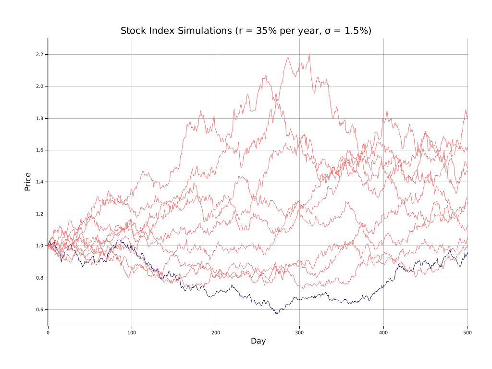
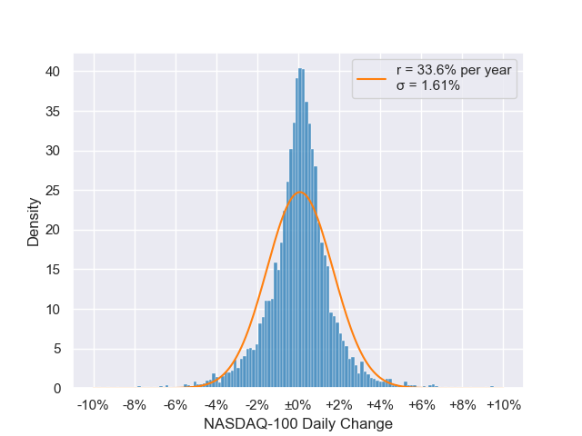
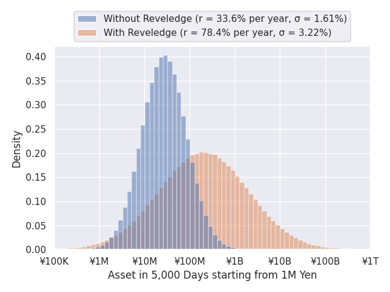

Stock price simulation based on the Black-Scholes process.

This repository is for my blog post about financial investment, which I'll publish soon.

# Stock index simulation

Run on Ubuntu by the following steps:

1. [Install Rust](https://rustup.rs/).
1. Install necessary packages: `sudo apt install pkg-config libfreetype6-dev libfontconfig1-dev`
1. `cargo run --example small_volatility`

You'll get a chart like this:

# Estimation of the parameters of NASDAQ-100 daily percentage change

Run on Ubuntu by the following steps:

1. Install pip: `sudo apt install python3-pip`
1. Install necessary Python libraries: `python3 -m pip install -r requirements.txt`
1. `python3 nasdaq_100_estimation.py`

You'll get 95% confidence intervals of the parameters on the console output.
In addtion, you'll get a histogram like this:

# NASDAQ-100 and 2x reveledged NASDAQ-100 index simulation

Run on Ubuntu by the following steps:

1. [Install Rust](https://rustup.rs/).
1. Install pip: `sudo apt install python3-pip`
1. Install necessary Python libraries: `python3 -m pip install -r requirements.txt`
1. `cargo run --release --example montecarlo_average`

You'll get a chart like this:

