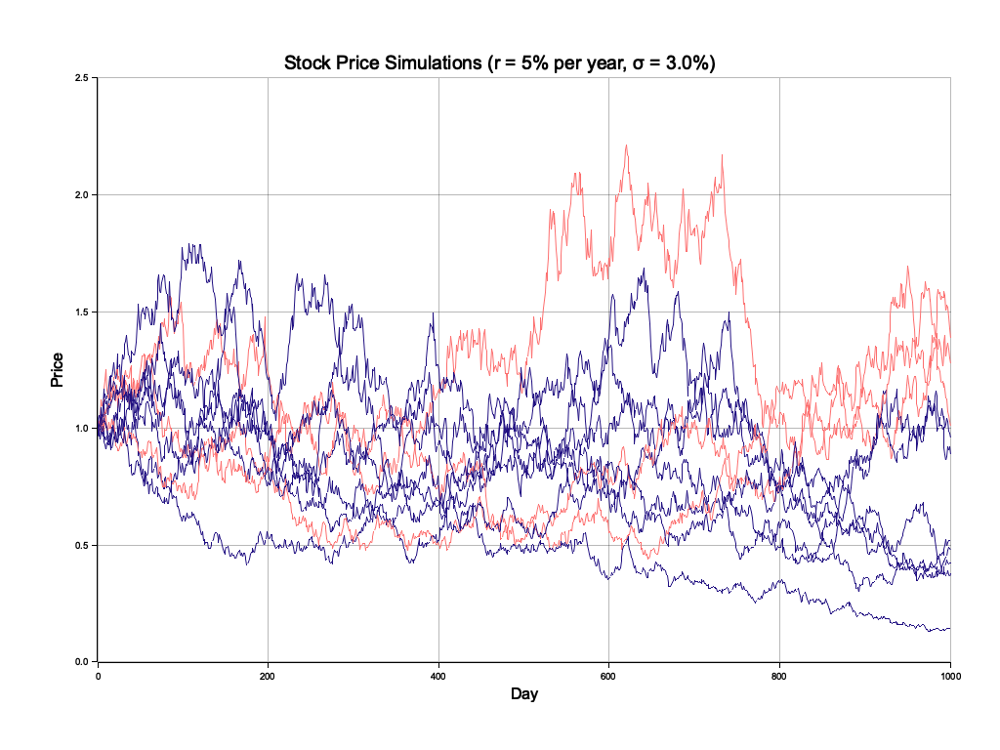
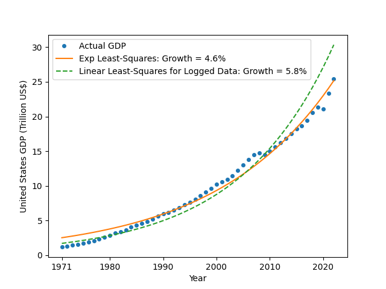

Stock price simulation based on the Black-Scholes process.

This repository is for my blog post about financial investment, which I'll publish soon.

# Stock price simulation

Run on Ubuntu by the following steps:

1. [Install Rust](https://rustup.rs/).
1. Install necessary packages: `sudo apt install pkg-config libfreetype6-dev libfontconfig1-dev`
1. `cargo run --example large_volatility`

You'll get a chart like this:

# Exponential curve fitting to United States GDP data

Run on Ubuntu by the following steps:

1. Install pip: `sudo apt install python3-pip`
1. Install necessary Python libraries: `python3 -m pip install -r requirements.txt`
1. `python3 gdp_fitting.py`

You'll get a chart like this:

