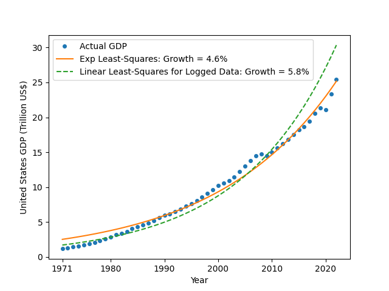

The files in this directory are the simulations I finally omitted from my blog post.

# Exponential curve fitting to United States GDP data

Run on Ubuntu by the following steps:

1. Install necessary Python library: `python3 -m pip install -r requirements.txt`
1. `python3 gdp_fitting.py`

You'll get a chart like this:

